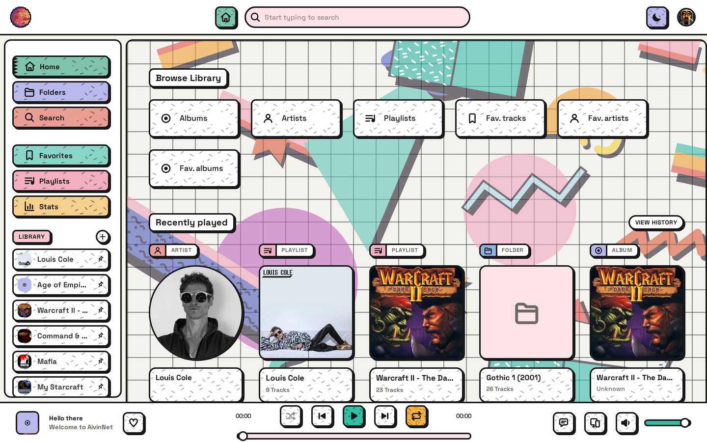
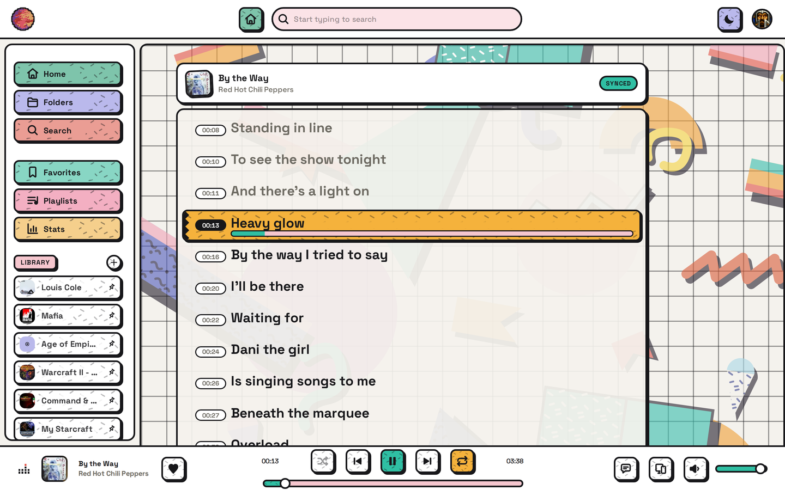
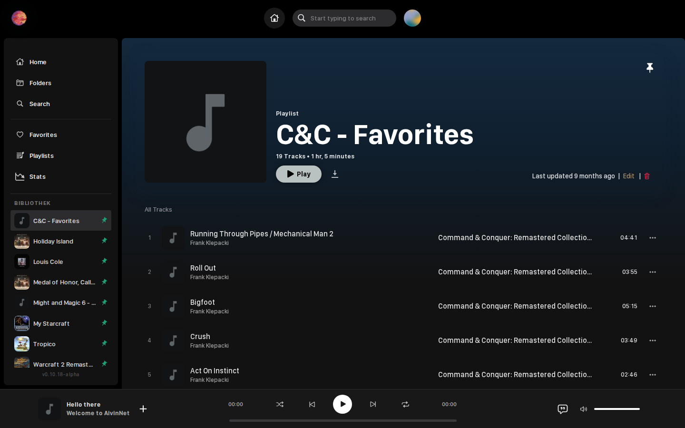
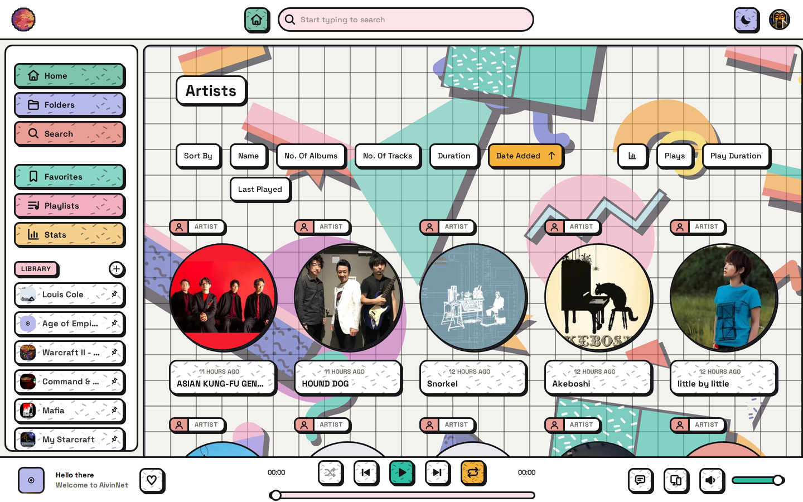
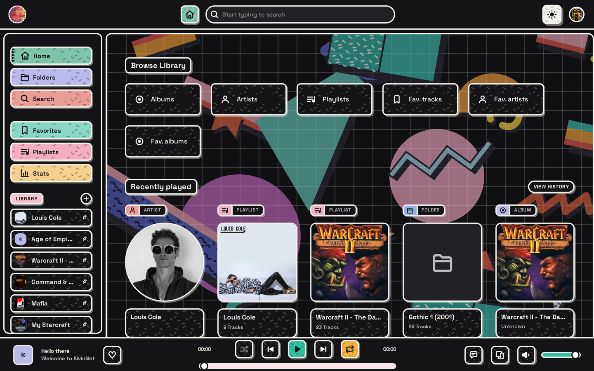
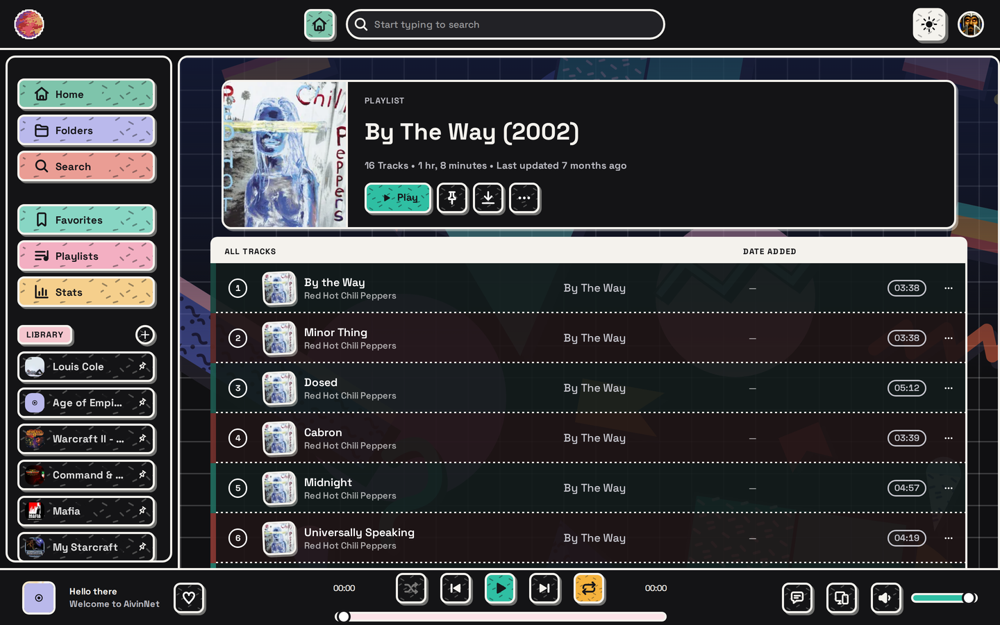

> # ⚠️ Moved
>
> **The AivinNet web client now lives in the main repository:
> [vwellenberg/AivinNet](https://github.com/vwellenberg/AivinNet), in `client/`.**
>
> This repository is archived and read-only. It is kept for its history: the pull
> request numbers up to #564 and the issues that links point at. Its full commit
> history came along with the move, so `git blame` in the new home reaches back
> through it.
>
> **Issues and pull requests go to
> [vwellenberg/AivinNet](https://github.com/vwellenberg/AivinNet/issues)** — one
> tracker for the server and the client, which is the point of the move.

# AivinNet Client

A Spotify-style music player frontend, branded as **AivinNet**. This is a fork of [swingmx/webclient](https://github.com/swingmx/webclient) with a full visual redesign and custom branding.

- Backend: [vwellenberg/AivinNet](https://github.com/vwellenberg/AivinNet)
- Frontend: [vwellenberg/AivinNet-Client](https://github.com/vwellenberg/AivinNet-Client)

---

## Screenshots

|                                                     |                                                        |
| --------------------------------------------------- | ------------------------------------------------------ |
| **Home** — browse your library                      | **Lyrics** — synced, with a per-line progress bar      |
|                   |           |
| **Playlist** — track list with ambient gradient     | **Artists** — library grid                             |
|      |                |

### Dark theme

The whole palette flips through the moon toggle in the top bar. With **Auto dark mode** on, it also
switches itself: dark from 20:00, light from 08:00, always in Berlin time so every device agrees.

|                                                     |                                                        |
| --------------------------------------------------- | ------------------------------------------------------ |
| **Home**                                            | **Playlist**                                           |
|  |  |

---

## Features

- Full visual redesign of the swingmusic webclient with custom **AivinNet** branding.
- Color-matched **ambient gradient** that tints album, artist, and playlist pages from the cover artwork.
- **Playlist power tools** — drag-and-drop track reordering, pin playlists to the sidebar, and play/pin/delete from a right-click menu.
- **MusicBrainz cover fetching** — grab a missing album cover with one click, or batch-fetch every missing cover from Settings with live progress.
- **Synced lyrics** — timestamped lines with a per-line progress bar; click a line to seek there.

See [FEATURES.md](FEATURES.md) for the full list, including how each item compares to upstream.

### Brand palette

| Token           | Hex       | Meaning        |
| --------------- | --------- | -------------- |
| `$brand-red`    | `#FF284E` | BCS red        |
| `$brand-green`  | `#1D9E75` | WAVENET green  |
| `$brand-purple` | `#7F77DD` | Frequency      |

Defined in `src/assets/scss/_variables.scss`.

---

## Tech Stack

- **Vue 3** + TypeScript
- **Pinia** (state management)
- **SCSS** (styling)
- **Vite** (build tool)
- **Vitest** (unit tests)

---

## Local Development

Requires Node 18+ and Yarn.

```bash
# Install dependencies
yarn install

# Start the development server
yarn dev

# Lint (auto-fix) / lint check only (CI)
yarn lint
yarn lint:check

# Run tests
yarn test
```

Tests live in `src/**/__tests__/` as `*.test.ts`.

---

## Build

```bash
yarn build
```

The production output is placed in the `dist/` folder.

---

## Deploy

The client is a static bundle. Build it, put `dist/` where the AivinNet backend looks for its
client, and restart the backend:

```bash
yarn build
rm -rf ~/.config/aivinnet/client
cp -r dist ~/.config/aivinnet/client
systemctl restart aivinnet
```

> **Note:** On Node 18, `yarn install` needs `--ignore-engines`.

---

## License

[MIT License](https://opensource.org/licenses/MIT)
