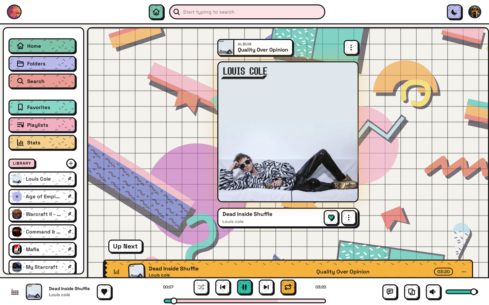

# AivinNet Client

A Spotify-style music player frontend, branded as **AivinNet**. This is a fork of [swingmx/webclient](https://github.com/swingmx/webclient) with a full visual redesign and custom branding.

- Backend: [vwellenberg/AivinNet](https://github.com/vwellenberg/AivinNet)
- Frontend: [vwellenberg/AivinNet-Client](https://github.com/vwellenberg/AivinNet-Client)

---

## Screenshots

|                                                     |                                                        |
| --------------------------------------------------- | ------------------------------------------------------ |
| **Home** — browse your library                      | **Now Playing** — cover plate, up next, transport      |
|                   |         |
| **Playlist** — track list with ambient gradient     | **Artists** — library grid                             |
|      |                |

---

## Features

- Full visual redesign of the swingmusic webclient with custom **AivinNet** branding.
- Color-matched **ambient gradient** that tints album, artist, and playlist pages from the cover artwork.
- **Playlist power tools** — drag-and-drop track reordering, pin playlists to the sidebar, and play/pin/delete from a right-click menu.
- **MusicBrainz cover fetching** — grab a missing album cover with one click, or batch-fetch every missing cover from Settings with live progress.

See [FEATURES.md](FEATURES.md) for the full list, including how each item compares to upstream.

### Brand palette

| Token           | Hex       | Meaning        |
| --------------- | --------- | -------------- |
| `$brand-red`    | `#FF284E` | BCS red        |
| `$brand-green`  | `#1D9E75` | WAVENET green  |
| `$brand-purple` | `#7F77DD` | Frequency      |

Defined in `src/assets/scss/_variables.scss`.

---

## Tech Stack

- **Vue 3** + TypeScript
- **Pinia** (state management)
- **SCSS** (styling)
- **Vite** (build tool)
- **Vitest** (unit tests)

---

## Local Development

Requires Node 18+ and Yarn.

```bash
# Install dependencies
yarn install

# Start the development server
yarn dev

# Lint (auto-fix) / lint check only (CI)
yarn lint
yarn lint:check

# Run tests
yarn test
```

Tests live in `src/**/__tests__/` as `*.test.ts`.

---

## Build

```bash
yarn build
```

The production output is placed in the `dist/` folder.

---

## Deploy to Server

The following command pulls the latest code, builds the project, deploys it to the server, and restarts the service:

```bash
ssh -i ~/.ssh/id_ed25519 vwellenberg@192.168.0.4 "cd ~/AivinNet-Client && git pull && NODE_OPTIONS='--dns-result-order=ipv4first' yarn install --ignore-engines --network-timeout 120000 2>&1 | tail -2 && NODE_OPTIONS='--dns-result-order=ipv4first' yarn build 2>&1 | tail -5 && rm -rf ~/.config/swingmusic/client && cp -r dist ~/.config/swingmusic/client && sudo -n systemctl restart aivinnet && echo deployed"
```

> **Note:** The server runs Node 18, so `--ignore-engines` is required for `yarn install`.

---

## License

[MIT License](https://opensource.org/licenses/MIT)
